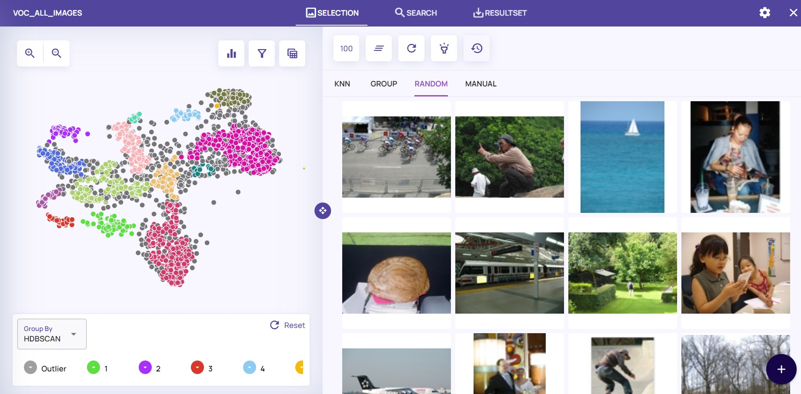
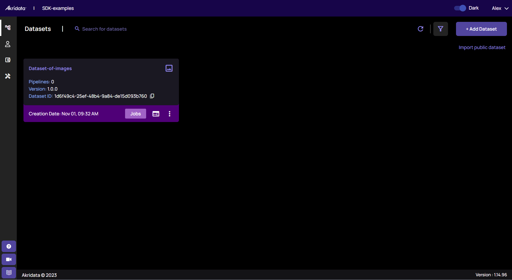
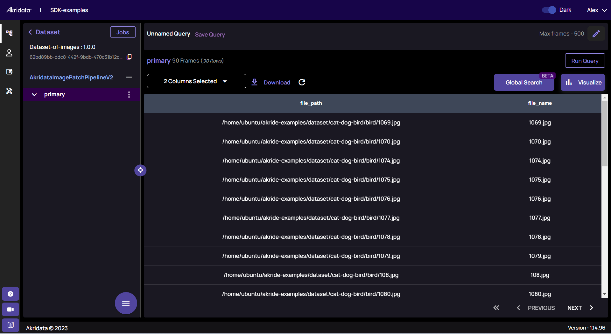
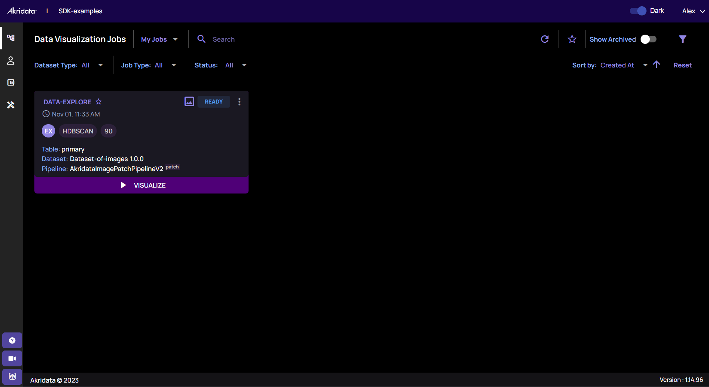
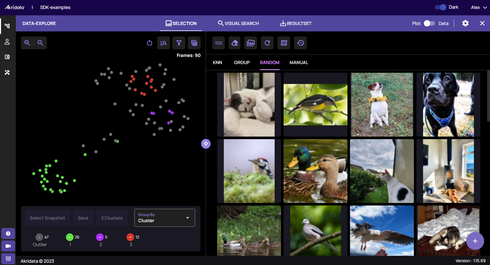

# Akridata's SDK for Visual Data Curation

**akride** is Akridata's client, connecting your Python environment with Akridata's powerful data management capabilities available in Data Explorer. 

Akridata's Data Explorer allows you to save time building the best training and test sets for your application. 

**akride** will help you:

*   Visualize your data
*   Detect and remove outliers
*   Check class imbalance
*   Sample the data and remove duplications
*   Apply Image-based-Search
*   Analyze model's accuracy

and much more!



### Prerequisites


Installation from:

(https://pypi.org/project/akride/)


- Python version 3.8 or higher is required to run the examples in this repository.
- We recommend using a virtual environment to manage your Python dependencies.

## Getting Started

To get started with the Python client, follow these steps:

### Step 1: Sign Up for an Akridata Account

1. Visit the Akridata website at [https://akridata.ai](https://akridata.ai).

2. Click on the "Try now" button or enter the URL [https://subscriptions.akridata.ai](https://subscriptions.akridata.ai) in your browser to register for an Akridata account.

3. Once you have registered, activate your account following the instructions provided in the confirmation email.

### Step 2: Obtain the SDK Config

1. Sign in to Akridata's Data Explorer using your newly created account credentials.

2. Navigate to the "Utilities" section (left bottom).

3. Select "Get CLI/SDK config."

4. You can copy the SDK configuration that is needed to interact with Akridata's services. Make sure to keep this configuration secure.

### Step 3: Define the client

Define Akride client with just one line of code:

```
client = AkriDEClient(sdk_config_dict=sdk_config_dict)
```

And own your data!

## Examples

A few examples are provided below in a form of a Notebook and Python code:

1. **Dataset Creation** - [Notebook](notebooks/create_dataset.ipynb), [Python](python_examples/create_dataset.py)
   
   Register a dataset on Data Explorer. Once completed, you can see this on the web interface:

   

2. **Data Ingestion** - [View Notebook](notebooks/ingest_data.ipynb), [Python](python_examples/ingest_data.py)

   After the dataset was registered and ingested, basic catalog information is available though the web interface too:

   

3. **Dataset Visualization** - [View Notebook](notebooks/explore_data.ipynb), [Python](python_examples/explore_data.py)

   Displaying the dataset allows you to visualize its structure, explore it and focus where most relevant for your task.
   
   This example creates an Exploration-job on the Data Explorer UI:
   
   

   Where the toy dataset is visible:

   


4. **Data Ingestion and Exploration** - [View Notebook](notebooks/akride_explore_dataset.ipynb)

   This notebook provides an example of how to ingest data into the Akridata Data Explorer application using the Python client. It shows how the client can be used to explore image data, run similarity searches, and create result sets within the Akridata platform.

   _Note: Make sure to follow the "Getting Started" steps to set up your environment and obtain the necessary SDK configuration before running this notebook._

## Documentation

For detailed documentation on how to use the akride client and its capabilities, please refer to the [official Akridata documentation](https://akridata-akride.readthedocs-hosted.com/en/latest/). For more information about Akridata's Data Explorer and other Akridata products, please refer to the [official product documentation](https://docs.akridata.ai/docs).

## Contributing

If you'd like to contribute to this repository, feel free to open issues, submit pull requests, or provide feedback. We welcome contributions from the community to make this repository more helpful to users.

## License

This repository is licensed under the Apache 2.0 License. See the [LICENSE](LICENSE) file for details.

---

For more information about Akridata, please visit [akridata.ai](https://www.akridata.ai).
