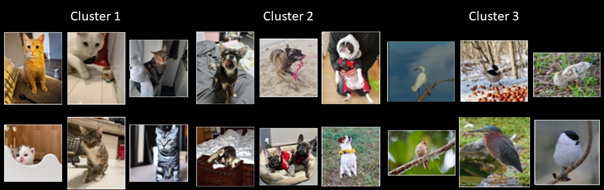
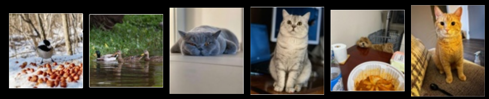
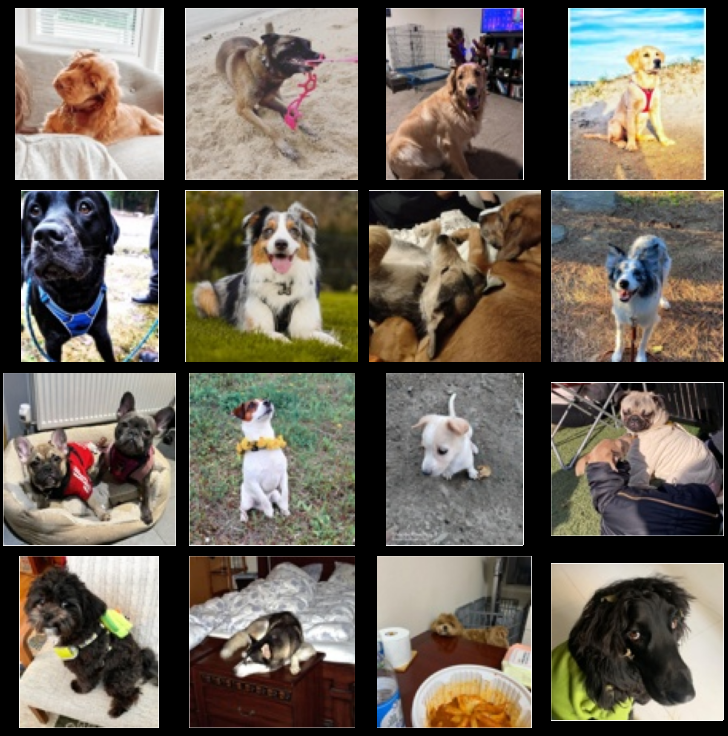

# Akridata's SDK for Visual Data Curation

**akride** is Akridata's client, connecting your Python environment with Akridata's powerful data management capabilities available in Data Explorer. 

Akridata's Data Explorer allows you to save time building the best training and test sets for your application. 

**akride** will help you:

*   Visualize your data
*   Detect and remove outliers
*   Check class imbalance
*   Sample the data and remove duplications
*   Apply Image-based-Search
*   Analyze model's accuracy

and much more!


## Prerequisites

Python version supported:


OS supported:

[](https://your-project-url)
[](https://your-project-url)
[](https://your-project-url)


## Installation:

Install from [Pypi](https://pypi.org/project/akride/) via:
```commandline
pip install akride
```

- Python version 3.8 or higher is required to run the examples in this repository.
- We recommend using a virtual environment to manage your Python dependencies.

## Getting Started

To get started with the Python client, follow these steps:

### Step 1: Sign Up for an Akridata Account

1. Visit the Akridata website at [https://akridata.ai](https://akridata.ai).

2. Click on the "Try now" button or enter the URL [https://subscriptions.akridata.ai](https://subscriptions.akridata.ai) in your browser to register for an Akridata account.

3. Once you have registered, activate your account following the instructions provided in the confirmation email.

### Step 2: Obtain the SDK Config

1. Sign in to Akridata's Data Explorer using your newly created account credentials.

2. Navigate to the "Utilities" section (left bottom).

3. Select "Get CLI/SDK config."

4. You can copy the SDK configuration that is needed to interact with Akridata's services. Make sure to keep this configuration secure.

### Step 3: Define the client

Define Akride client with just one line of code:

```
client = AkriDEClient(sdk_config_dict=sdk_config_dict)
```

And own your data!

## Examples

To get started with the SDK, a few examples are provided below in a form of a Notebook and Python code:

1. **Dataset Creation** - [Notebook](notebooks/create_dataset.ipynb), [Python](python_examples/create_dataset.py)
   
   First mandatory step is to register a dataset via the SDK. This is done via two lines of code:
   ```
   dataset_spec = {"dataset_name": "Dataset-of-images", "data_type": DataType.IMAGE}  # Use DataType.VIDEO for videos
   dataset = client.create_dataset(spec=dataset_spec)
   ```
   
   Once completed, you can see this on the web interface:

   

2. **Data Ingestion** - [View Notebook](notebooks/ingest_data.ipynb), [Python](python_examples/ingest_data.py)

   After registering the dataset, allow the client to process it:
   ```
   task = client.ingest_dataset(dataset=dataset, data_directory=path_to_images)
   ```
   Basic catalog information is available though the web interface after completion:

   

   Any additional information can be added to the catalog, such as: data source, time stamps, annotation information etc. 

   _Note:_ This step could take some time, based on dataset size and resources available.

3. **Dataset Visualization** - [View Notebook](notebooks/explore_data.ipynb), [Python](python_examples/explore_data.py)
 
   Visualizing your dataset allows you to Identify and remove *Outliers* from specific clusters or whole clusters altogether. 
   
   It is also the basis for *Balancing* your dataset. 
   
   To get started, create an Explore-Job:
   ```
   job_spec = client.create_job_spec(dataset=dataset, job_name="data-explore")
   job = client.create_job(spec=job_spec)
   ```
   
   The created Explore-job is visible on the Data Explorer UI:
   
   

   Where the toy dataset is visible:

   

   _Note:_
   
   Get the URL for the above job from the SDK by running:
   ```
   url = client.get_job_display_panel(job)
   ```
   
   As demonstrated in: [View Notebook](notebooks/view_dataset.ipynb), [Python](python_examples/view_dataset.py)

4. **Cluster Examples** - [View Notebook](notebooks/sample_display_clusters.ipynb), [Python](python_examples/sample_display_clusters.py)
   
   Visualizing the dataset can be done locally, without using Data Explorer's UI. 
   First, retrieve the number of clusters using:
   ```
   num_clusters = job.info.to_dict()["tunables_default"]["max_clusters"]
   ```
   
   Second, get a few examples from each cluster to be displayed in the notebook or saved to disk, based on the below code:
   ```
   spec = {"cluster_id": cluster_id, "max_count": number_of_example}
   samples = client.get_job_samples(job, JobContext.CLUSTER_RETRIEVAL, spec)
   thumbnails = client.get_thumbnail_images(samples)
   ```
   
   Basic results are visible below:
   

5. **Coreset Dataset Sampling** - [View Notebook](notebooks/coreset_sample_data.ipynb), [Python](python_examples/coreset_sample_data.py)

   Why annotate or train on the whole dataset? Apply **smart** sampling to preserve small clusters but train on only a portion of the data.
   
   The SDK supports Coreset sampling, where you can specify the percentage of the data to extract. 
   In the example below 30% of the data will be sampled:
   ```
   samples = client.get_job_samples(job, JobContext.CORESET_SAMPLING, {"percent": 30})
   ```
   
   Basic results of sampling a dataset are visible here:
   

6. **Visual Search** - [View Notebook](notebooks/visual_search.ipynb), [Python](python_examples/visual_search.py)

   Searching for specific examples for training or testing from within the dataset could take hours.
   
   **Save your time**
   
   The SDK allows you to specify one (or more) image and search for similar images throughout the whole dataset!
   
   Found images you didn't like? Mark them as accordingly and avoid similar images in the results.
   
   The code below illustrates the process, where "positive_samples" and "negative_samples" are lists of paths to the 
   relevant examples from your dataset:
   ```
   spec = {'positive_samples': positive_samples, 'negative_samples': negative_samples}
   samples = client.get_job_samples(job, JobContext.SIMILARITY_SEARCH, spec)
   ```
   
   Basic results of searching fo Dog images are visible here:
   

7. **Saving results** - [View Notebook](notebooks/resultset.ipynb), [Python](python_examples/resultset.py)
   
   After Sampling, Searching or otherwise processing the dataset, results can be saved into a Resultset, as shown below:
   ```
   result_set_spec = {"job": job, "name": "result-dog-search", "samples": samples}
   resultset = client.create_resultset(result_set_spec)
   ```
   This allows later retrieval of the data for training, testing and further analysis. 
   
8. **Putting it all together** - [View Notebook](notebooks/akride_explore_dataset.ipynb), [Python](python_examples/complete_flow.py)

   This example combines all the steps above to get the best of **akride** SDK

   _Note: Make sure to follow the "Getting Started" steps to set up your environment first._

## Documentation

For detailed documentation on how to use the akride client and its capabilities, 
please refer to the [official Akridata documentation](https://akridata-akride.readthedocs-hosted.com/en/latest/). 

For more information about Akridata's Data Explorer and other Akridata products, 
please refer to the [official product documentation](https://docs.akridata.ai/docs).

## Contributing

If you'd like to contribute to this repository, feel free to open issues, submit pull requests, or provide feedback. We welcome contributions from the community to make this repository more helpful to users.

## License

This repository is licensed under the Apache 2.0 License. See the [LICENSE](LICENSE) file for details.

---

For more information about Akridata, please visit [akridata.ai](https://www.akridata.ai).
